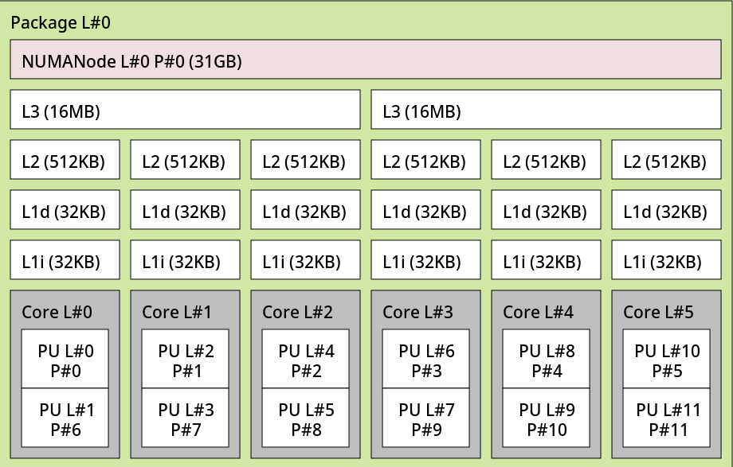
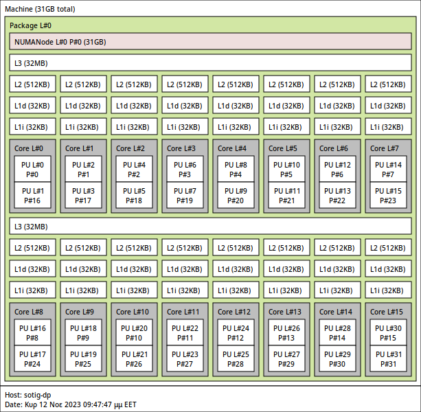

# Cpu pinning and isolation

Cpu pinning lets the virtual machine to run only on specified vcpus. You can combine this with cpu core isolation to achieve maximum performance.

## Use lstopo to reference the cpu topology

```sh
lstopo
```
This is the output for AMD Ryzen™ 5 3600 


From that we can link each core to its vcpus
This cpu has 6 cpus and 2 threads per cpu, that makes for 12 vcpus:

| CORE        | VCPU 1 | VCPU 2 |
| ----------- | ------ | ------ |
| CORE 0      | 0      | 6      | 
| CORE 1      | 1      | 7      | 
| CORE 2      | 2      | 8      | 
| CORE 3      | 3      | 9      | 
| CORE 4      | 4      | 10     | 
| CORE 5      | 5      | 11     | 

Now you have to decide which and how many core to reserve for the host and how many for the guest.

For this setup we will use core `0,1,2,3` for the guest vm and leave core `4` and `5` for the host.

### Get the vcpus
From the topology of the cpu we can now find out the vcpus we need for the guest and the host.

For the guest `0,6,1,7,2,8,3,9` vpus or `0-3,6-9` 

For the host `4,10,5,11` vcpus or `4-5,10-11`

## Dynamic cpu isolation

To isolate the vcpus at runtime we need to create a libvirt hook

Create a script named `/etc/libvirt/hooks/qemu.d/isolate-cpus.sh`

Paste the following script after editing the `reserved` and `cores` variables

The `reserved` variable refers to the host vcpus, so for my case `4-5,10-11`

The `cores` variable must have the whole range of vcpus of the system `0-11`

[Script Source](https://gist.github.com/oleduc/6d2f252d4ebb45f7dc8677523053c062)
```sh title="/etc/libvirt/hooks/qemu.d/isolate-cpus.sh"
#!/bin/bash

# Cores reserved for the host machine
# Must include QEMU IO/Emulation cores if configured
# Ex: 1st Core -> reserved=0
# Ex: 1st & 2nt Cores -> reserved=0,1
# Ex: 1st Physical Core (16 Virtual Cores) -> reserved=0,8
reserved=4-5,10-11

# Host core range numbered from 0 to core count - 1
# You must put all the cores of your host CPU
# Cores not in $cores_for_host are for Guests
# Ex: 8 Cores  -> cores=0-7
# Ex: 16 Cores -> cores=0-15
cores=0-11

# See Arch wiki for more informations https://wiki.archlinux.org/title/PCI_passthrough_via_OVMF#Isolating_pinned_CPUs

command=$2
valid_cmds='prepare,start,started,stopped,release,migrate,restore'

if [[ $command == "started" ]]; then
  echo "Hook/Qemu : isolate-cpus.sh : Isolate CPUS"
  systemctl set-property --runtime -- system.slice AllowedCPUs=$reserved
  systemctl set-property --runtime -- user.slice AllowedCPUs=$reserved
  systemctl set-property --runtime -- init.slice AllowedCPUs=$reserved
elif [[ $command == "release" ]]; then
  echo "Hook/Qemu : isolate-cpus.sh : Allow all CPUS"
  systemctl set-property --runtime -- system.slice AllowedCPUs=$cores
  systemctl set-property --runtime -- user.slice AllowedCPUs=$cores
  systemctl set-property --runtime -- init.slice AllowedCPUs=$cores
elif [[ $valid_cmds =~ $command ]]; then
  echo "Hook/Qemu : isolate-cpus.sh : Supported command but do nothing"
else
  echo "Invalid commands. Ex: ./script vm_name [prepare|start|started|stopped|release|migrate|restore]" >&2
  exit 1
fi
```

With this method libvirt will isolate the cpus when the vm starts and return them to the host when the vm stops

## Static cpu isolation

This method is more straight forward but the host will always ignore the cpus reserved for the guest

Edit the `/etc/default/grub` file and add to the GRUB_CMDLINE_LINUX_DEFAULT parameter:

* isolcpus=0-3,6-9
* nohz_full=0-3,6-9
* rcu_nocbs=0-3,6-9
 
Apply grub configuration
```sh
sudo grub-mkconfig -o /boot/grub/grub.cfg
```

## 5950X Configuration



### Guest cores
 
`0-7, 8-11, 24-27`

---

`0,16,1,17,2,18,3,19,4,20,5,21,6,22,7,23,8,24,9,25,10,26,11,27`

---

### Emulation cores

`12,28,13,29`

### Io threads

iothreadpin1: `12,28` 

iothreadpin2: `13,29`

### Host cores

`12,28,13,29,14,30,15,31`