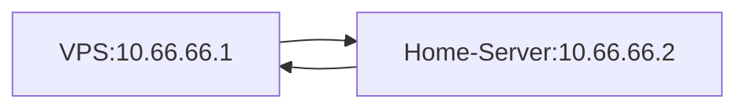

# ISP NAT BYPASS to expose home server to the web

## My ISP
For years now my ISP does not allow me to [Port Forward](https://en.wikipedia.org/wiki/Port_forwarding) my server. Some years ago I wanted to host a game server. Then I noticed that whatever I did, I could not access my server from any outside network. After trying everything I could find on the Internet and double checking everything like firewall rule on the server and router, I came to the conclusion that my service provider is probably blocking port forwarding somehow. I later confirmed that in my country this is a common practice with some ISPs. 

<!-- more -->

I decided to contact my ISP to figure out what could be done to resolve my issue. After a very long call, traversing through support ranks, arguing and verbally fighting them, they said that they would resolve the issue and port forwarding will be available.

I was very happy that I could finally have my server up, even though I had to fight with support. And things were fine for the next year, but as you can imagine this didn't last long.

Well, it happened again. My server was inaccessible and I had to contact my ISP one more time. However, this presented an opportunity to challenge myself. I wanted to see if there was anything that could be done to bypass all this and have things work without worrying about what my ISP decides their network will look like.

## The idea

I thought if I could somehow rent a VPS(Virtual Private Server) in a data center and use its public ip as a proxy for my server I could redirect traffic from the VPS to my home server.


However the same problem persists for this solution because the VPS cannot see the home server. 

## Using a VPN

The trick is to use a point to point VPN to connect the VPS with the home server. There are three popular [types](https://en.wikipedia.org/wiki/Virtual_private_network#Types) of vpn. For our purposes we will use a site to site vpn, so as to merge the VPS and home server networks together. That way we will create a way for the two servers to communicate through this network and bypass the ISPs NAT that ultimately blocks the ports.

This system will look something like this:


There are many ways to implement this. In most cases its a either a paid feature or a paid service. The free alternative I found is WireGuard VPN and a repo with a bash script that does everything automatically. [https://github.com/angristan/wireguard-install](https://github.com/angristan/wireguard-install)

## Setup the VPN

First lets connect to the VPS and install the vpn server.

```sh
curl -O https://raw.githubusercontent.com/angristan/wireguard-install/master/wireguard-install.sh
chmod +x wireguard-install.sh
./wireguard-install.sh
```

Follow the setup process and create a user. For more information read [here](https://github.com/angristan/wireguard-install/blob/master/README.md)

Lets say you created a client named myclient. You should see `wg0-client-myclient.conf` created in your user home directory.

If you `cat` this file you should see something like this
```conf
[Interface]
PrivateKey = *******************
Address = 10.66.66.2/32,fd42:42:42::3/128
DNS = 1.1.1.1,1.0.0.1

[Peer]
PublicKey = *******************
PresharedKey = *******************
Endpoint = xxx.xxx.xxx.xxx:51129
AllowedIPs = 0.0.0.0/0,::/0
```

Now we can use this file to connect the home server to the VPS. First connect to the home server and install `wireguard` and make sure the `wg-quick` command is available. After that copy the `wg0-client-myclient.conf` we got from the VPS and copy it in `/etc/wireguard/wg0.conf`

Enable IP forwarding
```sh
echo 'net.ipv4.ip_forward=1' >> /etc/sysctl.conf 
```

Finally run:

```sh
wg-quick up wg0
```

and hopefully the VPN should be ready. Now to make it run at startup lets add it to crontab.

```sh
sudo crontab -e
```
and add at the bottom of the file

```sh
@reboot wg-quick up wg0
```

Now the two server networks are connected and both can see each other. Lets test the connectivity by using the `ping` command. The VPS will have the `10.66.66.1` ip with the default configuration and the home server `10.66.66.2` unless you configured it differently.

```sh
# From the home server
ping 10.66.66.1

# Result
PING 10.66.66.1 (10.66.66.1) 56(84) bytes of data.
64 bytes from 10.66.66.1: icmp_seq=1 ttl=64 time=8.65 ms
64 bytes from 10.66.66.1: icmp_seq=2 ttl=64 time=10.2 ms
64 bytes from 10.66.66.1: icmp_seq=3 ttl=64 time=9.97 ms
```

```sh
# From the VPS form me the ip is 10.66.66.3
ping 10.66.66.3

# Result
PING 10.66.66.3 (10.66.66.3) 56(84) bytes of data.
64 bytes from 10.66.66.3: icmp_seq=1 ttl=64 time=10.1 ms
64 bytes from 10.66.66.3: icmp_seq=2 ttl=64 time=8.98 ms
64 bytes from 10.66.66.3: icmp_seq=3 ttl=64 time=10.8 ms
```

So now the network looks like this:



## VPN troubleshooting 

If ipv6 is not supported in your system, when for example running the vpn client in a docker container you can edit the `wg0.conf` to resolve the issue. Just remove the ipv6 definitions separated by a comma, resulting to a configuration like this:

```conf
[Interface]
PrivateKey = *******************
Address = 10.66.66.2/32
DNS = 1.1.1.1,1.0.0.1

[Peer]
PublicKey = *******************
PresharedKey = *******************
Endpoint = xxx.xxx.xxx.xxx:51129
AllowedIPs = 0.0.0.0/0
```

Furthermore docker requires to also use the `--cap-add=NET_ADMIN` argument when running the container.

## Make the Home Server accessible

This is it now we should be able to reroute all network request for a given port to our server by using the `socat` command.

```sh
socat TCP-LISTEN:80,fork TCP:10.66.66.2:80
```

That's it now the VPS port 80 should show the home server's port 80 and we have successfully bypassed the ISP.

Add the `socat` command to crontab starting with `@reboot` to make it permanent.

## Containers 

I run all my apps in containers, so I have created a docker image that sets up the wireguard client.

```dockerfile
FROM ubuntu:20.04

RUN apt update 
RUN apt install wireguard iproute2 openresolv iputils-ping -y 

RUN echo 'net.ipv4.ip_forward=1' >> /etc/sysctl.conf
   
ENTRYPOINT wg-quick up wg0 && ping 10.66.66.1 && while true; do sleep 10; done 
```

This particular dockerfile is designed to run as a sidecar container in a kubernetes pod but by configuring the entrypoint it can be used in any environment

## Final thoughts

While this is a very complicated way to essentially enable port forwarding, it has some benefits even if port forwarding is an available option. One benefit is that you do not expose your home ip address and network to the rest of the internet, thus protecting your privacy. All outsiders can see is the location of the data center event though the server is at home.

For me another benefit is that for 5 euros per month, I get a static ip on top of the added security mentioned above. My ISP charges 10 euros for a static ip.


